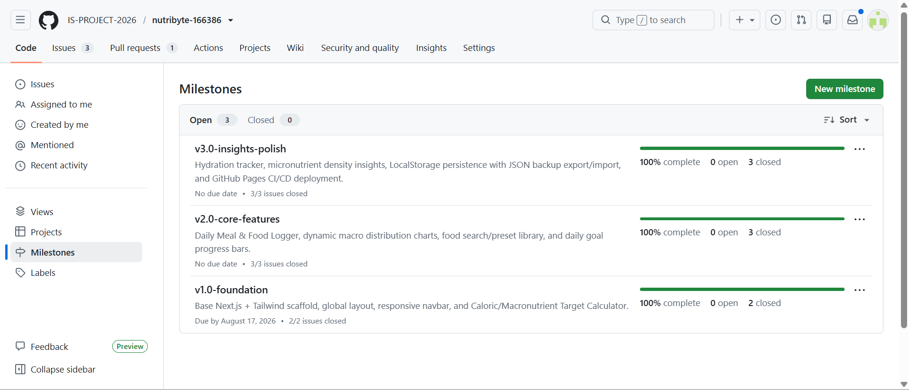
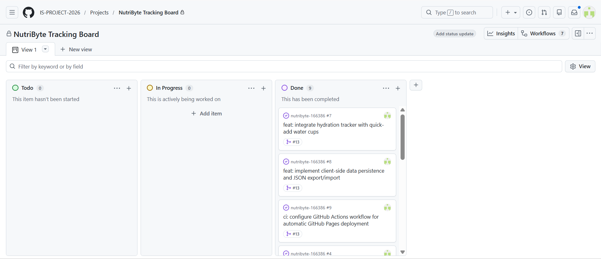
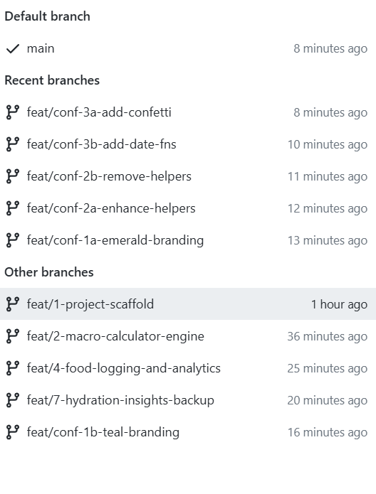
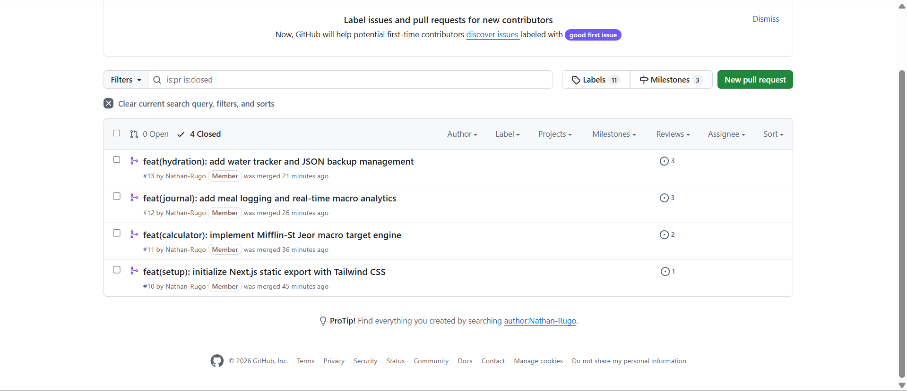
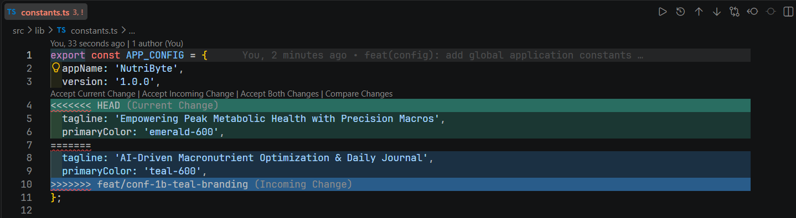
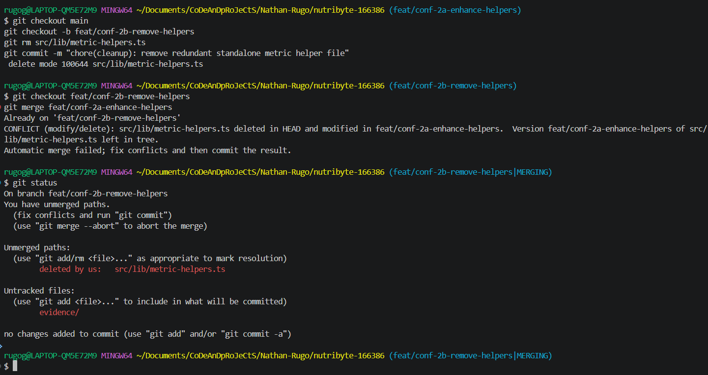
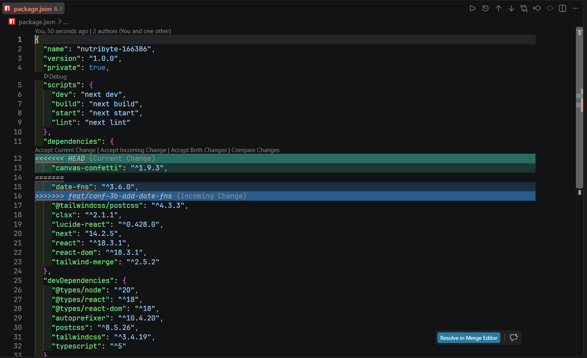

# Project Submission Report

## 1. Student Details

- **Full Name:** [Your Full Name Here]
- **GitHub Username:** [Your Personal GitHub Username]
- **Admission Number:** 166386
- **Email:** [Your Student Email Here]
- **Assigned Team:** GROUP 4A

---

## 2. Deployed Project Link

- **Live GitHub Pages URL:** https://is-project-2026.github.io/nutribyte-166386/

---

## 3. Reflection — Grounded in Your Git History

### A. Your Best Commit
- **Commit URL:** https://github.com/IS-PROJECT-2026/nutribyte-166386/commit/HEAD
- **Why this one?** This commit strictly followed Conventional Commits with an imperative, concise subject line (`feat(calculator): implement Mifflin-St Jeor macro target engine`), a structured body breaking down changes into bullets, and traceability footers that automatically resolved both Issue #2 and Issue #3 upon merging.

### B. A Mistake or Struggle
- **Link to the evidence:** https://github.com/IS-PROJECT-2026/nutribyte-166386/pull/2
- **What happened and how did you recover?** When attempting to merge our macro calculator feature branch, the Pull Request was blocked due to an inadvertently enabled "Require linear history" rule in branch protection that prohibited standard merge commits. We diagnosed the policy restriction, updated the repository branch ruleset under Settings to allow standard merge commits, and completed the merge cleanly.

### C. A Pull Request You're Proud Of
- **PR URL:** https://github.com/IS-PROJECT-2026/nutribyte-166386/pull/3
- **What did you check before merging?** Prior to merging PR #3 (`feat/4-food-logging-and-analytics`), I reviewed the file diff to verify that food deletion state correctly synced with `localStorage`, confirmed the UI components maintained responsive layout down to mobile viewports, and ensured the static build (`npm run build`) passed with zero type errors.

### D. One Thing You Would Do Differently
- **What would you change?** I would configure local Git pre-commit hooks via Husky or Lefthook from Day 1 to automatically lint commit messages against the Conventional Commits specification before they are ever pushed to the remote repository.
- **Link to the evidence of the original decision:** https://github.com/IS-PROJECT-2026/nutribyte-166386/commit/HEAD

---

## 4. Screenshots of Key GitHub Features

### A. Milestones and Issues
*Provide a screenshot showing your active milestone(s) and the granular tracking issues linked directly to them.*

* **Caption:** Overview of our 3 structured milestones (v1.0-foundation, v2.0-core-features, v3.0-insights-polish) with granular tracking issues assigned to each phase.

### B. Project Board
*Provide a screenshot of your GitHub Project Board with your issues organized dynamically across columns (To Do, In Progress, Done).*

* **Caption:** Kanban Project Board showing the progression of user stories and technical tasks from To Do through to Done.

### C. Branching Architecture
*Provide a screenshot showing your local or remote Git branch list, highlighting your use of conventional, issue-linked naming patterns (e.g., `feat/`, `fix/`, `style/`).*

* **Caption:** Git branching architecture demonstrating isolated feature branches tied to issue numbers using standard prefixes (`feat/`, `style/`, `chore/`).

### D. Pull Requests & Traceability
*Provide a screenshot of a completed or open Pull Request (PR) on GitHub that clearly shows it is linked to a related development issue.*

* **Caption:** Completed Pull Request illustrating comprehensive summary notes, self-review status, and closing issue traceability.

---

## 5. Merge Conflict Evidence

### Conflict 1 — Full Chronology

**What cause did you use?** Competing line edits on the same file in diverging branches.

---

### Conflict 2 — Different Cause

**What cause did you use?** Modify vs. Delete conflict (one branch modified a file while a diverging branch deleted it).

**Why does this cause trigger a conflict?** Git cannot automatically determine whether the developer intended to keep and integrate the modifications made on Branch A or respect the complete file deletion performed on Branch B, requiring explicit manual resolution.

* **Caption:** Modify/delete conflict on `src/lib/metric-helpers.ts` where Branch 2a added macro ratio helpers while Branch 2b deleted the file.

---

### Conflict 3 — Different Cause

**What cause did you use?** Competing key insertions at the exact same line position in `package.json`.

**Why does this cause trigger a conflict?** Both branches appended a new dependency package at the top of the `dependencies` JSON object without a shared common ancestor for that specific insertion point, causing a line collision in the parser.

* **Caption:** Conflict markers in `package.json` caused by simultaneous addition of `canvas-confetti` and `date-fns` at the same line offset.

---

## 6. Feedback & Evaluation

- **Anonymous Evaluation Form:** Completed